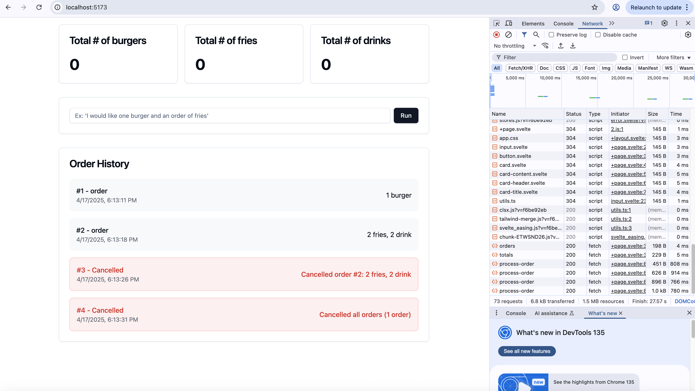

# Instructions

Create a mock drive thru ordering system that allows users to place and cancel their orders using AI.





For this project, assume the order item options are either 1) burgers, 2) fries, or 3) drinks. 

These are examples of user inputs and the corresponding actions to take:
* "I would like to order a burger" -> order of 1 burger
* "My friend and I would each like a fries and a drink" -> order for 2 fries, 2 drinks
* "Please cancel my order, order #2" -> cancel order #2


# Setup and Running Instructions

## Backend Setup
1. Navigate to the backend directory:
   ```bash
   cd backend
   ```

2. Create and activate a virtual environment (if not already done):
   ```bash
   python -m venv .venv
   source .venv/bin/activate  # On Windows use: .venv\Scripts\activate
   ```

3. Install dependencies:
   ```bash
   pip install -r requirements.txt
   ```

4. Set up your OpenAI API key:
   - Open the `.env` file in the backend directory
   - Add your OpenAI API key:
     ```
     OPENAI_API_KEY=your_api_key_here
     ```

5. Run the backend server:
   ```bash
   uvicorn main:app --reload
   ```
   The server will run on http://localhost:8000

## Frontend Setup
1. Navigate to the frontend directory:
   ```bash
   cd frontend
   ```

2. Install dependencies:
   ```bash
   npm install
   ```

3. Install required UI components:
   ```bash
   npx shadcn-svelte@latest add input
   npx shadcn-svelte@latest add card
   ```

4. Run the development server:
   ```bash
   npm run dev
   ```
   The frontend will run on http://localhost:5173

## UI Components Setup
The project uses shadcn-svelte for UI components. If you encounter missing component errors after pulling the project, you'll need to install the required components:

1. Install the input component:
   ```bash
   npx shadcn-svelte@latest add input
   ```

2. Install the card component:
   ```bash
   npx shadcn-svelte@latest add card
   ```

Note: These components are not tracked in version control and need to be installed locally after pulling the project.


